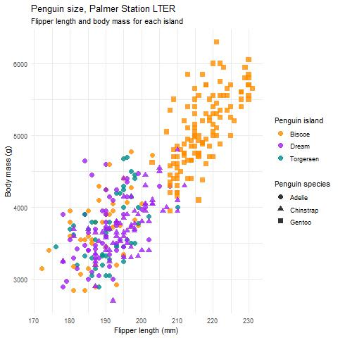
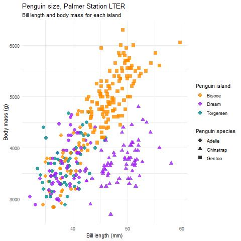

# Making Fancy Graphics


::: {.cell}

:::


### Create an Image/Graphic


::: {.cell}

:::


Edit the source code to edit the Figure heading in the brackets

Note: *The problem here is that the tif is too big to insert. I may need to insert a jpg for the compiled manusript, and then create a separate tif file for the final submission.*



## Now, Formatting this image!

### Create 3 more

Plot 2


::: {.cell}

```{.r .cell-code}
jpeg(filename="Figures/myplot2.jpg")
ggplot(data = penguins, 
                       aes(x = bill_length_mm,
                           y = body_mass_g)) +
  geom_point(aes(color = island, 
                 shape = species),
             size = 3,
             alpha = 0.8) +
  #theme_minimal() +
  scale_color_manual(values = c("darkorange","purple","cyan4")) +
  labs(title = "Penguin size, Palmer Station LTER",
       subtitle = "Bill length and body mass for each island",
       x = "Bill length (mm)",
       y = "Body mass (g)",
       color = "Penguin island",
       shape = "Penguin species") +
  theme_minimal() 
```

::: {.cell-output .cell-output-stderr}
```
Warning: Removed 2 rows containing missing values (geom_point).
```
:::

```{.r .cell-code}
dev.off()
```

::: {.cell-output .cell-output-stdout}
```
pdf 
  2 
```
:::
:::


Plot 3


::: {.cell}
::: {.cell-output .cell-output-stdout}
```
pdf 
  2 
```
:::
:::


Plot 4


::: {.cell}

```{.r .cell-code}
jpeg(filename="Figures/myplot4.jpg")
ggplot(data = penguins, aes(x = flipper_length_mm)) +
  geom_histogram(aes(fill = species)) +
  labs(x = "Flipper length (mm)",
       y = "Frequency",
       title = "Penguin flipper lengths")
```

::: {.cell-output .cell-output-stderr}
```
`stat_bin()` using `bins = 30`. Pick better value with `binwidth`.
```
:::

::: {.cell-output .cell-output-stderr}
```
Warning: Removed 2 rows containing non-finite values (stat_bin).
```
:::

```{.r .cell-code}
dev.off()
```

::: {.cell-output .cell-output-stdout}
```
pdf 
  2 
```
:::
:::


### And why not a table?

This table is split into two columns

::: {#tbl-panel layout-ncol="2"}
|             | Chinstrap | Gentoo | Adelie | **% Correct** |
|-------------|-----------|--------|--------|---------------|
| Chinstrap   | 70        | 0      | 0      | 100.0         |
| Gentoo      | 0         | 5      | 0      | 100.0         |
| Adelie      | 0         | 0      | 65     | 100.0         |
| **Overall** | \-        | \-     | \-     | 100.0         |

| LCI 0.95 | UCI 0.95 | Prior |
|----------|----------|-------|
| 94.9     | 100.0    | 50.0  |
| 47.8     | 100.0    | 3.6   |
| 94.5     | 100.0    | 46.4  |
| 97.4     | 100.0    | 46.7  |

Palmer Penguins Test Table
:::

### Put Plots Together

::: {layout="[[100,100], [100,100,100]]" layout-valign="bottom"}


|             | Chinstrap | Gentoo | Adelie | **% Correct** |
|-------------|-----------|--------|--------|---------------|
| Chinstrap   | 70        | 0      | 0      | 100.0         |
| Gentoo      | 0         | 5      | 0      | 100.0         |
| Adelie      | 0         | 0      | 65     | 100.0         |
| **Overall** | \-        | \-     | \-     | 100.0         |


| LCI 0.95 | UCI 0.95 | Prior |
|----------|----------|-------|
| 94.9     | 100.0    | 50.0  |
| 47.8     | 100.0    | 3.6   |
| 94.5     | 100.0    | 46.4  |
| 97.4     | 100.0    | 46.7  |


:::: columns
b)  {#fig-1111}
::::

:::: columns
c)  {#fig-2222}
::::

:::: columns
d)  {#fig-3333}
::::

My Pretty Pictures
:::
